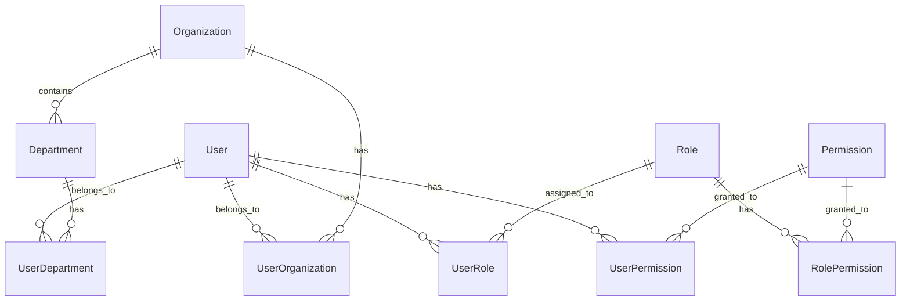

# 权限管理系统文档

本文档详细介绍了 Next.js 后台管理系统的权限访问控制系统的设计、配置和使用方法。

## 目录

- [系统概述](#系统概述)
- [数据模型](#数据模型)
- [权限检查](#权限检查)
- [组件使用](#组件使用)
- [API 接口](#api-接口)
- [中间件配置](#中间件配置)
- [初始化设置](#初始化设置)
- [最佳实践](#最佳实践)

## 系统概述

权限管理系统基于 **RBAC（基于角色的访问控制）** 模型，支持以下特性：

- 🏢 **多组织支持**：支持多个组织和部门结构
- 👥 **角色管理**：灵活的角色定义和权限分配
- 🔐 **细粒度权限**：支持页面、接口、操作级别的权限控制
- 📊 **数据权限**：支持基于数据范围的访问控制
- 🎯 **动态配置**：支持运行时动态配置权限规则
- 🔄 **继承机制**：支持权限继承和覆盖

## 数据模型

### 核心实体



### 权限类型

- **SYSTEM**：系统级权限（如用户管理、系统设置）
- **BUSINESS**：业务级权限（如订单管理、产品管理）
- **DATA**：数据级权限（如查看特定数据范围）
- **OPERATION**：操作级权限（如审批、导出）

### 角色级别

- **0**：超级管理员
- **1**：系统管理员
- **2**：部门经理
- **3**：业务人员
- **4**：客服人员
- **5**：普通用户

## 权限检查

### 服务端权限检查

```typescript
import { PermissionService } from '@/lib/services/permission.service'

const permissionService = new PermissionService()

// 检查单个权限
const hasPermission = await permissionService.checkPermission(
  userId,
  'users.create'
)

// 检查多个权限（AND 模式）
const hasAllPermissions = await permissionService.checkMultiplePermissions(
  userId,
  ['users.create', 'users.edit'],
  'AND'
)

// 检查角色
const hasRole = await permissionService.checkRole(
  userId,
  ['ADMIN', 'MANAGER'],
  'OR'
)

// 检查角色级别
const hasLevel = await permissionService.checkRoleLevel(userId, 2)

// 检查资源访问权限
const canAccess = await permissionService.checkResourceAccess(
  userId,
  'orders',
  'read',
  'order-123'
)
```

### 客户端权限检查

```typescript
import { usePermission, useRole, useRoleLevel } from '@/hooks/use-permission'

function MyComponent() {
  const { hasPermission, loading } = usePermission('users.create')
  const { hasRole } = useRole(['ADMIN', 'MANAGER'], 'OR')
  const { hasLevel } = useRoleLevel(2)

  if (loading) return <div>Loading...</div>
  if (!hasPermission) return <div>Access Denied</div>

  return <div>Content</div>
}
```

## 组件使用

### 权限保护组件

```tsx
import { PermissionGuard, ButtonGuard, MenuGuard, FieldGuard } from '@/components/auth/permission-guard'

// 页面级权限保护
<PermissionGuard permission="users.view">
  <UserListPage />
</PermissionGuard>

// 按钮权限保护
<ButtonGuard permission="users.create">
  <Button>创建用户</Button>
</ButtonGuard>

// 菜单权限保护
<MenuGuard permission="users.manage">
  <MenuItem>用户管理</MenuItem>
</MenuGuard>

// 字段权限保护
<FieldGuard permission="users.view_salary" mode="mask">
  <Input value={salary} />
</FieldGuard>

// 多权限检查
<PermissionGuard 
  permissions={['users.view', 'users.edit']} 
  permissionMode="AND"
>
  <UserEditForm />
</PermissionGuard>

// 角色检查
<PermissionGuard 
  roles={['ADMIN', 'MANAGER']} 
  roleMode="OR"
>
  <AdminPanel />
</PermissionGuard>

// 级别检查
<PermissionGuard level={2}>
  <ManagerDashboard />
</PermissionGuard>
```

### 高阶组件

```tsx
import { withPermission } from '@/components/auth/permission-guard'

const ProtectedComponent = withPermission(MyComponent, {
  permission: 'users.view',
  fallback: <div>Access Denied</div>
})
```

## API 接口

### 权限检查接口

```bash
# 检查单个权限
POST /api/permissions/check
{
  "permission": "users.create",
  "resource": "users",
  "action": "create"
}

# 检查多个权限
POST /api/permissions/check-multiple
{
  "permissions": ["users.view", "users.edit"],
  "mode": "AND"
}

# 检查角色
POST /api/permissions/check-role
{
  "roles": ["ADMIN", "MANAGER"],
  "mode": "OR"
}

# 检查角色级别
POST /api/permissions/check-level
{
  "level": 2
}

# 获取用户权限信息
GET /api/permissions/user/{userId}

# 获取用户菜单权限
GET /api/permissions/menu/{userId}
```

## 中间件配置

### 路由权限配置

```typescript
// lib/middleware/permission.middleware.ts

// 添加路由权限
addRoutePermission('/admin/users', {
  permissions: ['users.view'],
  roles: ['ADMIN', 'MANAGER'],
  level: 2,
  mode: 'AND'
})

// 添加 API 权限
addApiPermission('/api/users', 'POST', {
  permissions: ['users.create'],
  roles: ['ADMIN'],
  mode: 'AND'
})
```

### 动态权限规则

```typescript
// 基于组织的权限
addRoutePermission('/org/:orgId/users', {
  permissions: ['users.view'],
  organizations: ['ORG_001'],
  mode: 'AND'
})

// 基于部门的权限
addRoutePermission('/dept/:deptId/reports', {
  permissions: ['reports.view'],
  departments: ['DEPT_SALES'],
  mode: 'AND'
})
```

## 初始化设置

### 1. 数据库迁移

```bash
# 生成 Prisma 客户端
npm run db:generate

# 推送数据库架构
npm run db:push

# 或者使用迁移
npm run db:migrate
```

### 2. 初始化权限数据

```bash
# 初始化基础权限数据
npm run permissions:init

# 清理权限数据
npm run permissions:clean

# 重置权限数据
npm run permissions:reset
```

### 3. 配置环境变量

```env
# .env.local
NEXTAUTH_SECRET=your-secret-key
DATABASE_URL=your-database-url
```

### 4. 创建管理员用户

```bash
# 运行种子脚本
npm run db:seed
```

## 最佳实践

### 1. 权限命名规范

```typescript
// 推荐的权限命名格式：{resource}.{action}
'users.view'        // 查看用户
'users.create'      // 创建用户
'users.edit'        // 编辑用户
'users.delete'      // 删除用户
'orders.approve'    // 审批订单
'reports.export'    // 导出报表
```

### 2. 角色设计原则

- **最小权限原则**：只分配必要的权限
- **职责分离**：不同角色承担不同职责
- **权限继承**：高级角色继承低级角色权限
- **业务对齐**：角色设计与业务流程对齐

### 3. 组件权限检查

```tsx
// ✅ 推荐：使用权限保护组件
<PermissionGuard permission="users.create">
  <CreateUserButton />
</PermissionGuard>

// ❌ 不推荐：在组件内部进行权限检查
function CreateUserButton() {
  const { hasPermission } = usePermission('users.create')
  if (!hasPermission) return null
  return <Button>创建用户</Button>
}
```

### 4. 错误处理

```tsx
// 提供友好的错误提示
<PermissionGuard 
  permission="users.view"
  errorMessage="您没有权限查看用户信息，请联系管理员"
  showError={true}
>
  <UserList />
</PermissionGuard>
```

### 5. 性能优化

```typescript
// 批量检查权限
const permissions = await permissionService.checkMultiplePermissions(
  userId,
  ['users.view', 'users.edit', 'users.delete'],
  'OR'
)

// 缓存权限结果
const cachedPermissions = useMemo(() => {
  return userPermissions
}, [userPermissions])
```

### 6. 测试权限

```typescript
// 测试权限检查逻辑
describe('Permission Service', () => {
  it('should check user permission correctly', async () => {
    const hasPermission = await permissionService.checkPermission(
      'user-123',
      'users.create'
    )
    expect(hasPermission).toBe(true)
  })
})
```

## 故障排除

### 常见问题

1. **权限检查失败**
   - 检查用户是否已登录
   - 确认权限名称是否正确
   - 验证数据库中是否存在相关权限记录

2. **中间件不生效**
   - 检查 `middleware.ts` 配置
   - 确认路由匹配规则
   - 查看控制台错误信息

3. **组件权限保护无效**
   - 确认组件是否在客户端渲染
   - 检查 `useSession` 是否正常工作
   - 验证 API 接口是否返回正确数据

### 调试技巧

```typescript
// 启用调试日志
const permissionService = new PermissionService({ debug: true })

// 检查用户权限信息
console.log('User permissions:', await permissionService.getUserPermissions(userId))

// 检查权限树
console.log('Permission tree:', await permissionService.getUserPermissionTree(userId))
```

## 更新日志

### v1.0.0
- 初始版本发布
- 支持基础 RBAC 功能
- 提供权限保护组件
- 集成中间件权限检查

---

如有问题或建议，请联系开发团队或提交 Issue。